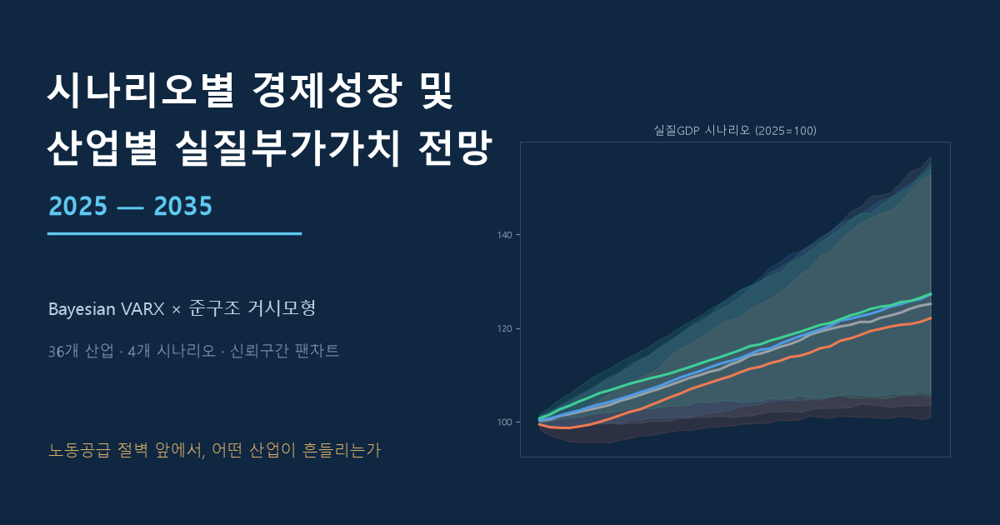

# 시나리오별 경제성장 및 산업별 실질부가가치 전망 (2025~2035)

> 베이지안 VARX × 준구조 거시모형으로 36개 산업의 10년 경로를 시나리오별로 추정한다.
> 노동공급 절벽 앞에서, 어떤 산업이 흔들리는가 — 팀 공유용 연구 메모.

**📄 문서 보기:** https://sdkparkforbi.github.io/gva-scenario-2025-2035/



## 무엇을 했나

제안서 *「시나리오별 경제성장 및 산업별 실질부가가치 전망(2025~2035) 연구」* 의 설계를
**DSGE 추정을 제외하고** 실제 데이터·코드로 구현한 결과물이다.

- **Block 1 (거시·노동)** — 한국은행 BOKDPM을 Python으로 이식한 준구조 NK gap 모형.
  인구추계·대외충격을 받아 유가·교역·실질금리·실질환율·고용 경로를 생성한다.
- **Block 2 (산업 분해)** — 36개 산업 실질부가가치 증가율의 베이지안 VARX.
  미네소타 사전분포 + 산업연관표 정보로 약 5,000개 모수를 안정적으로 추정한다.
- **시나리오 S1~S4** — 노동공급(통계청 장래인구추계 중위/저위/고위) × 대외환경 2축.
  사후분포에서 70%·90% 신뢰구간 팬차트를 산출한다.

## 데이터

| 영역 | 출처 |
|---|---|
| 산업별 실질부가가치(분기) | 한국은행 ECOS 국민계정 (200Y103/104) |
| 산업연관표(투입·생산유발계수) | 한국은행 ECOS (271Y, 2015~2023) |
| 거시 외생변수 | ECOS(금리·환율·물가·교역) + Brent 유가(FRED) |
| 생산연령인구 추계 | 통계청 KOSIS 장래인구추계 (DT_1BPA003) |

## 구조

```
code/
  fetch_*.py            데이터 수집 (ECOS·KOSIS·FRED·I-O)
  backcast_labor.py     취업자 시계열 동적요인 칼만평활 복원
  bvar_industry.py      36산업 베이지안 VAR (미네소타, λ 주변우도 선택)
  bvar_analysis.py      연결성·GIRF·FEVD (Diebold–Yılmaz)
  bvarx_industry.py     외생변수 결합 BVARX
  dsge_block1.py        BOKDPM 포트 (Block 1 거시·노동 경로)
  scenario_projection.py  S1~S4 시나리오 전망 + 팬차트
data/                   주요 결과 CSV
index.html              연구 메모 (본문)
```

## 재현

```bash
python code/fetch_gdp_quarterly.py
python code/fetch_gdp_industry.py
python code/fetch_exog.py
python code/backcast_labor.py
python code/bvar_industry.py
python code/bvarx_industry.py
python code/dsge_block1.py
python code/scenario_projection.py
```
필요 패키지: `numpy pandas scipy statsmodels requests matplotlib`.
API 키(`API_KEY_BOK.txt`, `API_KEY_KOSIS.txt`)는 저장소에 포함하지 않는다.

## 한계

산업 36개(목표 70개)·Dynare 미실행(Python 이식)·1999년 이전 고용 복원·S2의 노동/대외 혼합·
연쇄가중 실질 비가법성. 자세한 내용은 문서 §9 참조.

---
*정식 논문 집필 전 팀 내부 공유용 초안. 모든 수치는 위 코드로 재현 가능합니다.*
